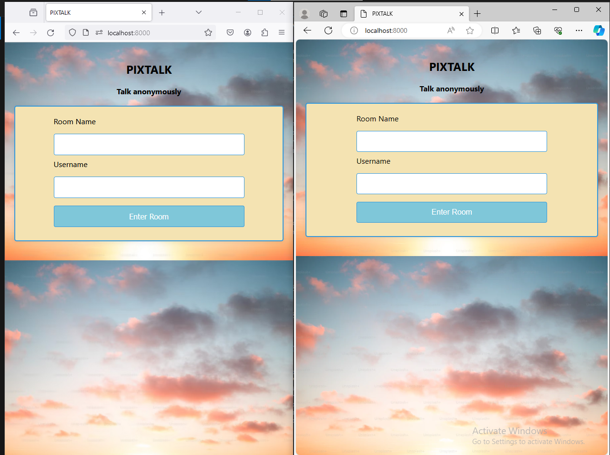
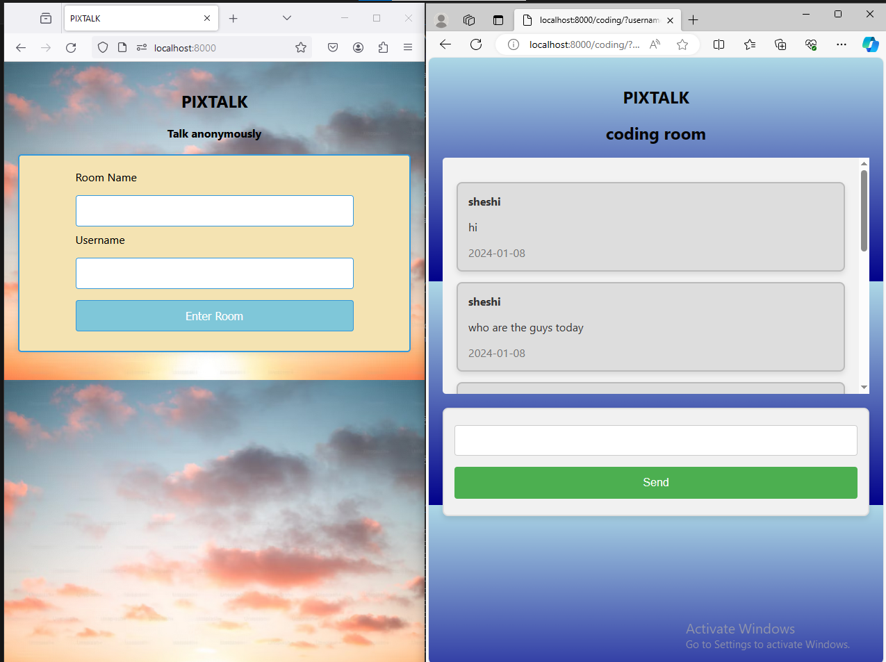
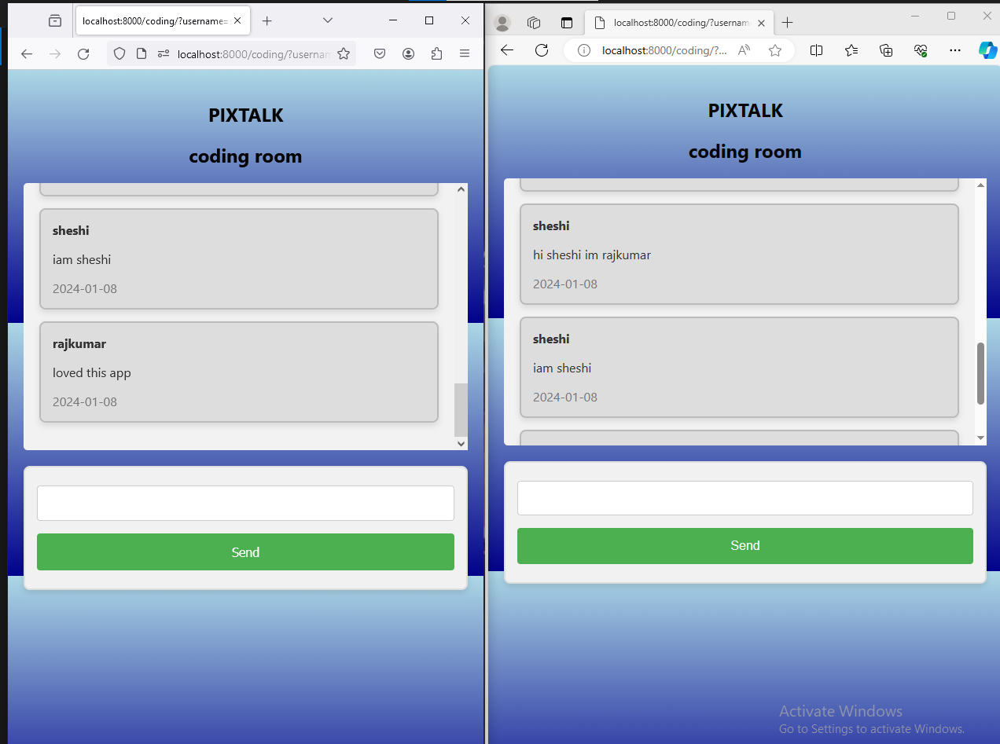

# PixTalk- Group Chat App

## Overview
This Django-based group chat application allows users to create and join chat rooms, exchange messages, and stay connected with other users in real-time.

## Features
- **Room Creation:** Users can create new chat rooms and set a unique name for each room.
- **Room Joining:** Users can join existing chat rooms by entering the room name.
- **Real-time Messaging:** Messages are updated in real-time without requiring a page refresh.
- **Message Timestamps:** Each message displays the sender's username, the message content, and the timestamp.
- **Responsive Design:** The application is designed to work seamlessly across various devices and screen sizes.

## Technologies Used
- **Django:** The web framework for building the application.
- **Django Channels:** Enables handling WebSockets for real-time communication.
- **JavaScript/jQuery:** Used for client-side interactions and AJAX requests.
- **HTML and CSS:** For structuring and styling the user interface.
- **SQLite:** The default database engine for Django.

## Setup Instructions
1. Clone the repository:
   ```bash
   git clone https://github.com/nsvoriginals/PixTalk.git

2.cd PixTalk
3.pip install -r requirements.txt
4.python manage.py makemigrations
5.python manage.py migrate
6.python manage.py runserver

After these steps open your web browser and go to http://localhost:8000 to access the application.







